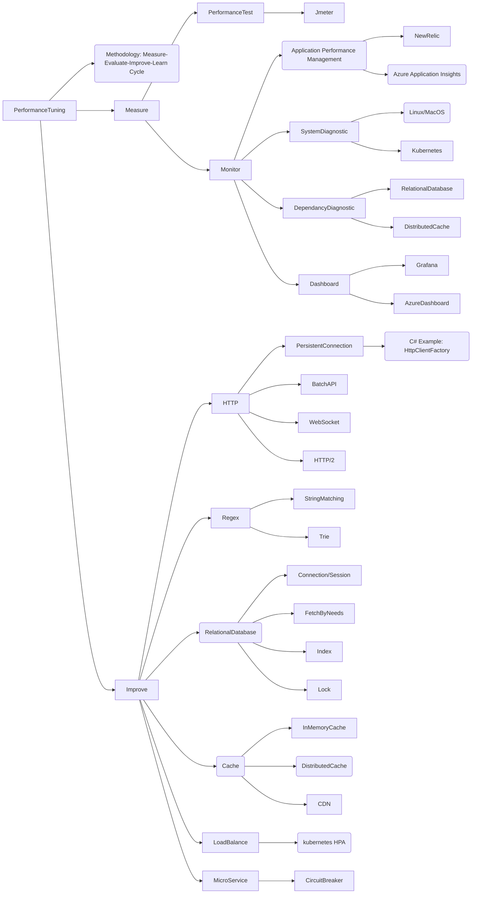

# Awesome Performance Tuning

Awesome lists about web performance tuning topics. Focus on but not limited to server side.

## Prerequisites

* Mermaid, this readme includes mind-mapping which render by mermaid
  * [github-mermaid-extension](https://github.com/BackMarket/github-mermaid-extension) for github, before github support this feature, please install this extension to your browser for better experience. 
  * [GitLab 10.3](https://docs.gitlab.com/ee/user/markdown.html#diagrams-and-flowcharts-using-mermaid), gitlab only support rendering mermaid after 10.3.
  * [Typora](https://typora.io/), or any markdown tool that support mermaid rendering.
* Todo: [Jupyter Interactive Notebook](https://jupyter-notebook.readthedocs.io/), a modern web-based notebook environment for interactive computing.

## Overview

## Methodology

### Measure-Evaluate-Imporve-Learn Cycle

## Measure

### Performance Test

#### Jmeter

### Monitor

#### Application Performance Management(APM)

* Newrelic
* Azure Application Insights

#### System Diagsitic

##### Linux/MacOS

* CPU
* Memory
* Network
* I/O

##### Kubernetes(Azure Kubernetes Service)

* Nodes
* Pods
* CPU
* Memory
* Network
* I/O

#### Dependancy Diagnostic

##### Relational Database(Azure SQL Server)

* CPU
* Memory
* Slow Query
* Azure DTU

##### Distributed Cache(Redis or Memcached)

* Memory

#### Dashboard

##### Grafana

##### Azure App Insights

## Improve

### HTTP

HTTP is slow long time ago. People try [many ways](https://developer.mozilla.org/en-US/docs/Web/HTTP/Basics_of_HTTP/Evolution_of_HTTP) to improving HTTP Latency. However, if we use it in a wrong way, the application resource is exhausted as the old time.

#### HTTP Persistent Connection(HTTP Keep-Alive)

Http Persistent Connection use a single TCP connection to send and receive multiple HTTP requests/responses, as opposed to opening a new connection for every single request/response pair.

##### C# Example: HttpClientFactory

`HttpClient` is a well-known class in C#, but it isn't being properly used usually.
The first issue is when this class is disposable, the underlying socket is not immediately released and can cause a serious issue named 'sockets exhaustion'. Therefore, it's designed to be instantiated once and reused in the application. So a possible approache to solve this issue is to create a singleton or a static `HttpClient`, but it cause the second issue, that it would not respect DNS changes. To do this, .NET core introduce `HttpClientFactory`. `HttpClientFactory` is available since .NET core 2.1. `HttpClientFactory` manages the lifetime of `HttpClientMessageHandles` to avoid the mentioned issues that can occur when managing `HttpClient` lifetimes yourself. For more information about how to use `HttpClientFactory`, see [Use HttpClientFactory to implement resilient HTTP requests](https://docs.microsoft.com/en-us/dotnet/architecture/microservices/implement-resilient-applications/use-httpclientfactory-to-implement-resilient-http-requests).

To see the details of how to speed up HTTP in a hard way, see:

- [Sockets Performance and SocketsHttpHandler in dotnet core app](https://devblogs.microsoft.com/dotnet/announcing-net-core-2-1-preview-2/#user-content-sockets-performance-and-socketshttphandler)
- [Persistence Is The Way to Happiness of libcurl](https://curl.haxx.se/libcurl/c/libcurl-tutorial.html)

#### Batch API

#### WebSocket

#### HTTP/2

### Regex

Regex is a CPU killer. Time complexity: O(M×N×N), M is number of URLs, N is the lenght of URL.

#### Optimise 1: String Matching

Note: Implemented. Time complexity O(M×N), M is number of URLs, N is the lenght of URL.

#### Optimise 2: Trie(Prefix tree)

Note: Not Implemented yet. Time complexity: O(N), N is the lenght of URL.

### Relational Database

#### Connection/Session

#### Fetch by Needs

#### Index 

### Cache

#### In-Memory Cache

#### Distributed Cache(Redis)

#### CDN(AWS CloudFront)

### Load Balance

#### Kubernetes HPA

### MicroService

#### Circuit Breaker

## How to Contribute

If you want to be a trainer or speaker, `trainer/speaker` is welcome.
If you find new topic to share, or new topic to learn, `topic` issue is welcom.
